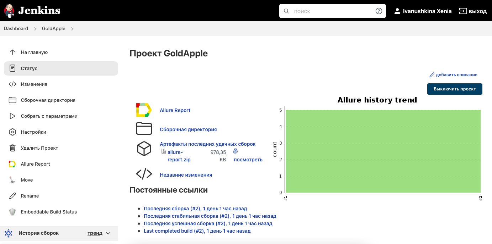
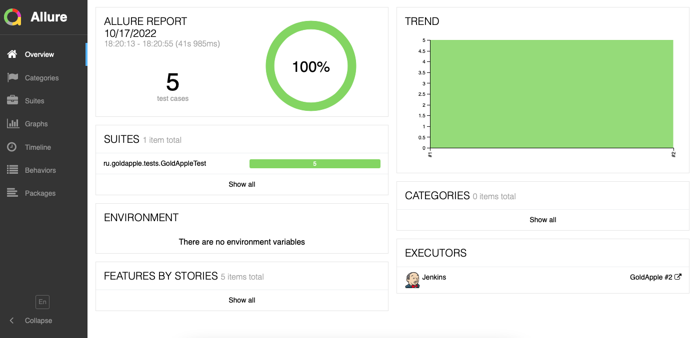
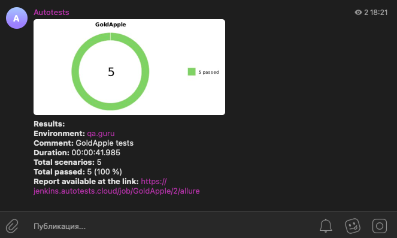

# Проект по автоматизации тестирования интернет-магазина "Золотое яблоко" 
<p align="center"></p>

## Содержание
- [Использованный стек технологий](#computer-использованный-стек-технологий)
- [Реализованные проверки](#scroll-реализованные-проверки)
- [Запуск тестов](#running_woman-запуск-тестов)
- [Сборка в Jenkins](#-сборка-в-jenkins)
- [Пример Allure-отчета](#-пример-allure-отчета)
- [Уведомления в Telegram с использованием бота](#-уведомления-в-telegram-с-использованием-бота)
- [Видео пример прохождения теста](#-видео-пример-прохождения-таста)

## Использованный стек технологий

<p align="center">


</p>

## Реализованные проверки

- Проверка смены текущего города на Екатеринбург.
- Проверка заголовка пустой корзины.
- Проверка открытия формы авторизации при открытии вкладки вишлист.
- Проверка открытия формы авторизации при открытии вкладки профиля.
- Проверка видимости строки поиска.

## Запуск тестов

### Локальный запуск тестов
С параметрами по умолчанию
```
gradle clean test
```

### Запуск тестов удаленно

```
clean test
-Dbrowser_name=${BROWSER_NAME}
-Dbrowser_version=${BROWSER_VERSION}
-Dbrowser_size=${BROWSER_SIZE}
-Dselenide.remote=${REMOTE_BROWSER_URL}
```
##  Сборка в Jenkins
Ссылка на сборку https://jenkins.autotests.cloud/job/GoldApple
<p align="center">

</p>

##  Пример Allure-отчета
<p align="center">

</p>

##  Уведомления в Telegram с использованием бота
<p align="center">

</p>

## Видео пример прохождения теста

<p align="center">
  
</p>
